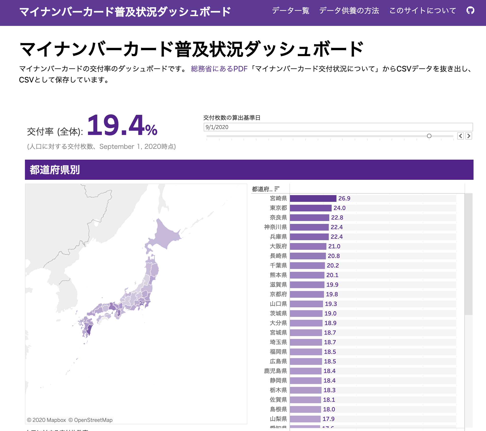

総務省で公開している、マイナンバーカード普及率についてのPDFファイルから、グラフを作成しました。

## 一言で言うと

"玉" の呪いがかかっており、2つの埼玉が現出した

## 入力

[総務省 マイナンバーカード交付状況](https://www.soumu.go.jp/kojinbango_card/)

* PDFデータ
* その後 Excel データも公開された

## 出力

[マイナンバーカード普及率ダッシュボード](https://mynumbercard.code4japan.org/)

* Tablau でグラフ化
* クレンジング後の CSV も公開

## もっと詳しく

* [供養手順の解説](https://mynumbercard.code4japan.org/chant)
* [[動画] Code for Japan Summit 2020 「BADオープンデータ供養寺 〜本当にあったデータの怖い話〜」](/articles/movies)

